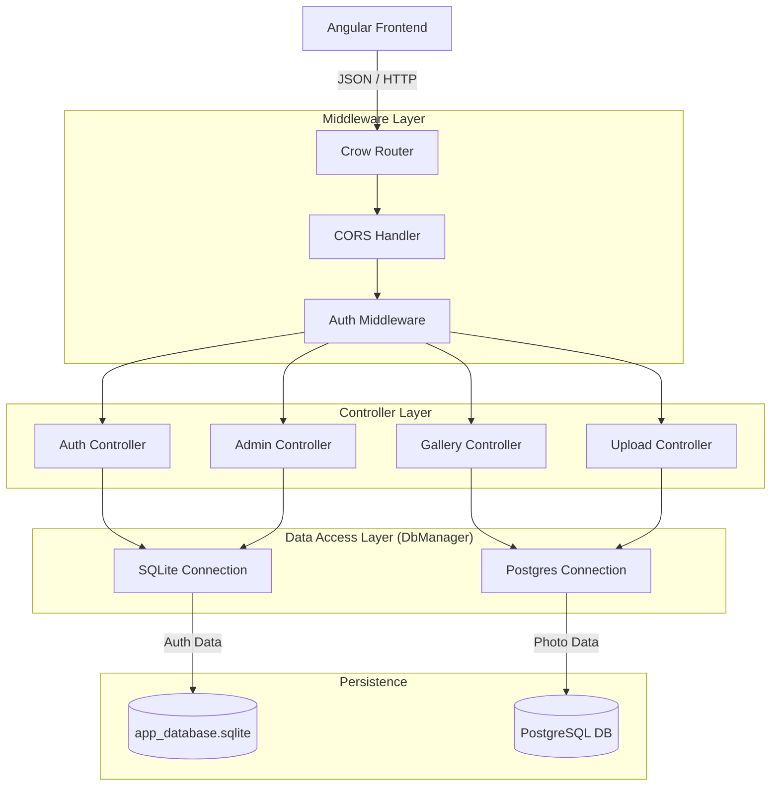

<div id="top" align="center">
<h1>CrowQtServer</h1>

<p>High-Performance ReST-API Backend</p>
<p>Part of the Crow-Gallery Project</p>

[](https://choosealicense.com/licenses/mit/)
[](https://github.com/Zheng-Bote/web-gallery_webserver/releases)

[Report Issue](https://github.com/Zheng-Bote/web-gallery_webserver/issues) · [Request Feature](https://github.com/Zheng-Bote/web-gallery_webserver/pulls)

</div>

<hr>

<!-- START doctoc generated TOC please keep comment here to allow auto update -->
<!-- DON'T EDIT THIS SECTION, INSTEAD RE-RUN doctoc TO UPDATE -->
**Table of Contents**

- [Description](#description)
  - [🚀 Features](#-features)
    - [🔐 Security & Authentication](#-security--authentication)
    - [🗄️ Hybrid Database System](#-hybrid-database-system)
    - [⚙️ User Management](#-user-management)
    - [🖼️ Image Processing](#-image-processing)
- [⚙️ Installation & Setup](#-installation--setup)
  - [📂 Project Structure](#-project-structure)
- [🔌 API Endpoints (Overview)](#-api-endpoints-overview)
- [🏗️ Architecture](#-architecture)
  - [System Architecture](#system-architecture)
  - [Key Technical Decisions](#key-technical-decisions)
  - [🛠️ Tech Stack](#-tech-stack)
- [📄 License](#-license)

<!-- END doctoc generated TOC please keep comment here to allow auto update -->

<hr>

# Description


**CrowQtServer** is a high-performance, multithreaded REST API designed for the CrowGallery application. It leverages the speed of the **Crow Microframework** for asynchronous HTTP routing while utilizing the robustness of **Qt 6** for database management, file system operations, and string handling.

This server acts as the secure core of the application, handling JWT authentication, hybrid database interactions (SQLite & PostgreSQL), and image metadata processing.

---

## 🚀 Features

### 🔐 Security & Authentication

- **JWT Implementation:** Uses `jwt-cpp` to issue short-lived **Access Tokens** and secure, long-lived **Refresh Tokens**.
- **Bcrypt Hashing:** Passwords are salted and hashed using `libbcrypt` before storage.
- **Middleware Architecture:**
  - **AuthMiddleware:** Validates Bearer tokens before requests reach protected controllers.
  - **CORSHandler:** Custom implementation to handle Preflight (`OPTIONS`) requests correctly.
- **Role-Based Protection:** specific routes (e.g., User Management) are locked to the `admin` role.

### 🗄️ Hybrid Database System

- **SQLite (Authentication):** Fast, file-based storage for user credentials, roles, and tokens (`app_database.sqlite`).
- **PostgreSQL (Gallery Data):** Scalable, relational storage for millions of photos, Exif/IPTC metadata, and keywords.
- **Thread-Safe Pooling:** Implements a custom **Thread-Local Connection Pool**. Since Crow is multithreaded and `QSqlDatabase` is not thread-safe, the server creates a unique, named database connection for every active thread.

### ⚙️ User Management

- **CRUD Operations:** Admins can Create, Delete, and Deactivate users.
- **Security Policies:**
  - **Force Password Change:** Logic to force users to reset credentials upon next login (e.g., after an admin reset).
  - **Self-Service:** Endpoints for users to change their own passwords securely.

### 🖼️ Image Processing

- **Metadata Extraction:** Parsers for Exif, IPTC, and XMP data.
- **Smart Uploads:** Transaction-safe ingestion of new images into the PostgreSQL database.

---

# ⚙️ Installation & Setup

**Prerequisites**

- C++ Compiler (GCC 10+, Clang 11+, or MSVC 2019+)
- CMake (3.14 or higher)
- Qt 6 SDK (Ensure Qt6Sql and Qt6Network are installed)
- PostgreSQL Server (running locally or remotely)

**Installation**

1. Clone the Repository

   ```Bash
   git clone https://github.com/Zheng-Bote/crow-qt-server.git
   cd crow-qt-server
   ```

2. Configure Environment (.env)

Create a .env file in your root (or build) directory to configure the server:

```Ini, TOML
PORT=8080
JWT_SECRET=CHANGE_THIS_TO_A_LONG_RANDOM_STRING

# PostgreSQL Configuration

PG_HOST=localhost
PG_PORT=5432
PG_DB=Photos
PG_USER=postgres
PG_PASS=your_password
```

3. Build the Project

```Bash
mkdir build
cd build
cmake ..
make -j4 4. Run the ServerBash./CrowQtServer
```

**Note:** On the very first run, the server will automatically create the app_database.sqlite file and generate a default Admin User:

- Username: admin
- Password: secret

  Please change this password immediately via the API or Frontend.

## 📂 Project Structure

```bash
src/
├── controllers/       # Route definitions (Auth, Admin, Upload)
├── middlewares/       # Request pre-processing (Auth, CORS)
├── services/          # Business logic layer
├── main.cpp           # Entry point & Server configuration
├── db_manager.cpp     # QtSQL wrapper & Connection Pooling
├── db_manager.hpp     # Database Interface
├── utils.hpp          # Helper functions
└── CMakeLists.txt     # Build configuration
```

# 🔌 API Endpoints (Overview)

| Method | Endpoint                            | Description                            | Access |
| ------ | ----------------------------------- | -------------------------------------- | ------ |
| POST   | /login                              | Authenticate and retrieve tokens       | Public |
| POST   | /refresh                            | Get new Access Token via Refresh Token | Public |
| GET    | /api/auth/me                        | Get current user status & flags        | User   |
| POST   | /api/user/change-password           | Change own password                    | User   |
| GET    | /api/admin/usersList                | all registered users                   | Admin  |
| POST   | /api/admin/users                    | Create a new user                      | Admin  |
| PUT    | /api/admin/users/:id/status         | Lock/Unlock a user account             | Admin  |
| POST   | /api/admin/users/:id/reset-password | Force-reset a user's password          | Admin  |

# 🏗️ Architecture

The project follows a **Controller-Service-Repository** pattern adapted for modern C++.

## System Architecture



## Key Technical Decisions

- QT + Crow Hybrid:

  - We use Crow for the Web Server because it is significantly faster and lighter than Qt's QHttpServer.
  - We use Qt Core/Sql because its database drivers and string manipulation (QString) are superior to standard C++ for business logic.

  -- Concurrency Model:

  - Crow spawns multiple worker threads.
  - The DbManager uses QThread::currentThreadId() to assign specific database connections to specific threads. This ensures lock-free, thread-safe database access without race conditions.

## 🛠️ Tech Stack

Language: C++ 23

Web Framework: CrowCore

Framework: Qt 6.x (Modules: Core, Sql, Network)

Dependencies:

- nlohmann/json (JSON Serialization)
- jwt-cpp (Token Generation/Validation)
- libbcrypt (Password Hashing)
- dotenv (Environment Configuration)

# 📄 License

Distributed under the MIT License. See LICENSE for more information.
